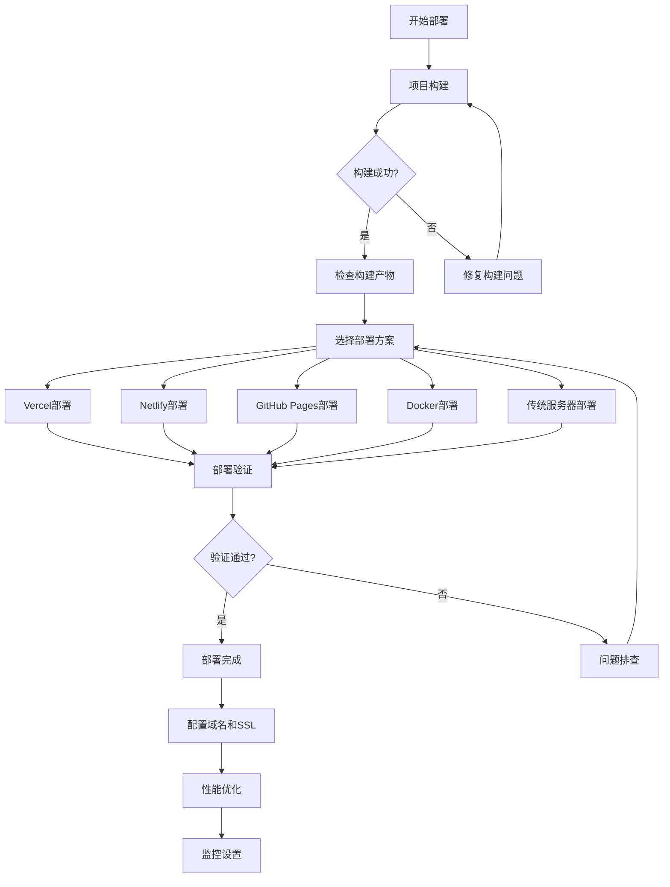

# PhotoDesign 📸

一个专业的摄影设计项目管理平台，为摄影师、设计师和创意团队提供项目管理、预算控制、团队协作和灵感收集的一站式解决方案。

<div align="center">


### 🚀 快速部署

[](https://vercel.com/new/clone?repository-url=https%3A%2F%2Fgithub.com%2F%3Cusername%3E%2FPhotoDesign&project-name=photodesign&repository-name=PhotoDesign)
&nbsp;&nbsp;
[](https://app.netlify.com/start/deploy?repository=https://github.com/%3Cusername%3E/PhotoDesign)

*点击上面按钮一键部署到云端（需将链接中的 `%3Cusername%3E` 替换为您的 GitHub 用户名）*

</div>

## 📚 目录

- [✨ 核心功能](#-核心功能)
- [🛠️ 技术栈](#️-技术栈)
- [🚀 快速开始](#-快速开始)
- [🚀 项目部署](#-项目部署) ⭐
- [📁 项目结构](#-项目结构)
- [🎨 功能特色](#-功能特色)
- [🔧 开发指南](#-开发指南)
- [🎯 使用场景](#-使用场景)
- [🔮 未来规划](#-未来规划)
- [🤝 贡献指南](#-贡献指南)
- [📄 许可证](#-许可证)
- [💖 支持项目](#-支持项目)
- [📞 联系方式](#-联系方式)

## ✨ 核心功能

### 🎯 项目管理
- 创建和管理多种类型的摄影项目（人像、风景、产品、婚礼、活动、商业等）
- 项目状态跟踪（策划中、已预约、进行中、已完成）
- 项目详情和概览展示

### 💰 预算管理
- 项目预算设置和跟踪
- 费用分类管理（设备、场地、团队、道具、差旅等）
- 支出状态监控（计划中、已确认、已支付）

### 👥 团队协作
- 团队成员管理和角色分配
- 联系信息和确认状态跟踪
- 薪酬管理和支付状态跟踪

### 📝 任务管理
- 详细的任务清单系统
- 任务优先级和分类管理
- 截止日期和负责人分配

### 🎨 灵感收集
- 灵感图片收集和分类
- 标签系统便于快速检索
- 支持多种灵感类别（姿势、灯光、构图、色彩、氛围等）

### 👤 客户管理
- 客户信息和联系方式管理
- 项目需求记录
- 交付日期和格式要求跟踪

### 📷 拍摄规划
- 设备清单管理（相机、镜头、灯光、配件）
- 道具和服装清单
- 拍摄设置和特殊要求记录

## 🛠️ 技术栈

### 前端框架
- **React 18.3.1** - 现代化的前端框架
- **TypeScript 5.5.3** - 类型安全的JavaScript
- **Vite 5.4.2** - 快速的构建工具

### 样式和UI
- **Tailwind CSS 3.4.1** - 实用优先的CSS框架
- **Lucide React 0.344.0** - 优雅的图标库

### 开发工具
- **ESLint 9.9.1** - 代码质量检查
- **PostCSS** - CSS处理工具
- **TypeScript ESLint** - TypeScript代码规范

## 🚀 快速开始

### 环境要求
- Node.js >= 18.0.0
- npm, yarn 或 pnpm

### 安装依赖
```bash
# 使用 npm
npm install

# 使用 yarn
yarn install

# 使用 pnpm
pnpm install
```

### 启动开发服务器
```bash
# 使用 npm
npm run dev

# 使用 yarn  
yarn dev

# 使用 pnpm
pnpm dev
```

项目将在 `http://localhost:5173` 启动

### 构建生产版本
```bash
# 构建
npm run build

# 预览构建结果
npm run preview
```

### 代码检查
```bash
npm run lint
```

## 🚀 项目部署

### 构建生产版本

在部署之前，首先构建生产版本：

```bash
# 构建项目
npm run build

# 本地预览构建结果
npm run preview
```

构建完成后，会在 `dist/` 目录生成以下文件：
- `index.html` - 主页面文件
- `assets/` - 包含 CSS 和 JavaScript 文件

### 部署方案

#### 1. 🌟 Vercel 部署（推荐）

**特点**：免费、自动 HTTPS、全球 CDN、Git 集成、零配置

**🚀 一键部署**：

[](https://vercel.com/new/clone?repository-url=https%3A%2F%2Fgithub.com%2F%3Cusername%3E%2FPhotoDesign&project-name=photodesign&repository-name=PhotoDesign)

> 💡 **提示**：请将上面链接中的 `%3Cusername%3E` 替换为您的 GitHub 用户名

**手动部署**：

```bash
# 安装 Vercel CLI
npm install -g vercel

# 登录并部署
vercel

# 生产环境部署
vercel --prod
```

**自动部署**：连接 GitHub 仓库后，每次推送代码会自动触发部署。

**配置文件** `vercel.json`（可选）：
```json
{
  "framework": "vite",
  "buildCommand": "npm run build",
  "outputDirectory": "dist",
  "installCommand": "npm install",
  "devCommand": "npm run dev",
  "rewrites": [
    {
      "source": "/(.*)",
      "destination": "/index.html"
    }
  ]
}
```

#### 2. 🚀 Netlify 部署

**特点**：免费、表单处理、分支预览、函数支持

**🚀 一键部署**：

[](https://app.netlify.com/start/deploy?repository=https://github.com/%3Cusername%3E/PhotoDesign)

> 💡 **提示**：请将上面链接中的 `%3Cusername%3E` 替换为您的 GitHub 用户名

**手动部署**：

```bash
# 安装 Netlify CLI
npm install -g netlify-cli

# 登录
netlify login

# 初始化并部署
netlify init
netlify deploy --prod --dir=dist
```

**拖拽部署**：直接将 `dist` 文件夹拖拽到 Netlify 网站上。

**配置文件** `netlify.toml`：
```toml
[build]
  command = "npm run build"
  publish = "dist"

[[redirects]]
  from = "/*"
  to = "/index.html"
  status = 200
```

#### 3. 🐙 GitHub Pages 部署

**方案一：GitHub Actions 自动部署**

创建 `.github/workflows/deploy.yml`：
```yaml
name: Deploy to GitHub Pages

on:
  push:
    branches: [ main ]

jobs:
  build-and-deploy:
    runs-on: ubuntu-latest
    
    steps:
    - name: Checkout
      uses: actions/checkout@v4

    - name: Setup Node.js
      uses: actions/setup-node@v4
      with:
        node-version: '18'
        cache: 'npm'

    - name: Install dependencies
      run: npm ci

    - name: Build
      run: npm run build

    - name: Deploy to GitHub Pages
      uses: peaceiris/actions-gh-pages@v3
      with:
        github_token: ${{ secrets.GITHUB_TOKEN }}
        publish_dir: ./dist
```

**方案二：手动部署**
```bash
# 构建项目
npm run build

# 使用 gh-pages 包部署
npm install -g gh-pages
gh-pages -d dist
```

#### 4. 🐳 Docker 部署

**Dockerfile**：
```dockerfile
# 构建阶段
FROM node:18-alpine as build

WORKDIR /app
COPY package*.json ./
RUN npm ci --only=production
COPY . .
RUN npm run build

# 生产阶段
FROM nginx:alpine
COPY --from=build /app/dist /usr/share/nginx/html
COPY nginx.conf /etc/nginx/conf.d/default.conf
EXPOSE 80
CMD ["nginx", "-g", "daemon off;"]
```

**nginx.conf**：
```nginx
server {
    listen 80;
    server_name localhost;

    location / {
        root /usr/share/nginx/html;
        index index.html index.htm;
        try_files $uri $uri/ /index.html;
    }

    # 静态资源缓存
    location /assets/ {
        root /usr/share/nginx/html;
        expires 1y;
        add_header Cache-Control "public, immutable";
    }

    # Gzip 压缩
    gzip on;
    gzip_vary on;
    gzip_min_length 1024;
    gzip_proxied any;
    gzip_comp_level 6;
    gzip_types
        text/plain
        text/css
        text/xml
        text/javascript
        application/javascript
        application/xml+rss
        application/json;
}
```

**构建和运行**：
```bash
# 构建镜像
docker build -t photodesign .

# 运行容器
docker run -p 3000:80 photodesign
```

#### 5. 📦 传统服务器部署

**Apache 配置** `.htaccess`：
```apache
RewriteEngine On
RewriteBase /
RewriteRule ^index\.html$ - [L]
RewriteCond %{REQUEST_FILENAME} !-f
RewriteCond %{REQUEST_FILENAME} !-d
RewriteRule . /index.html [L]
```

**Nginx 配置**：
```nginx
location / {
    try_files $uri $uri/ /index.html;
}
```

### 部署流程图



### 部署检查清单

#### ✅ 部署前检查
- [ ] 代码已提交到仓库
- [ ] 构建命令正常执行
- [ ] 本地预览测试通过
- [ ] 环境变量已配置
- [ ] 依赖版本兼容性确认

#### ✅ 部署后验证
- [ ] 网站可以正常访问
- [ ] 所有页面路由正常
- [ ] 静态资源加载正常
- [ ] 响应式布局正常
- [ ] 浏览器兼容性测试
- [ ] 本地存储功能正常

### 常见问题解决

#### 1. 路由 404 问题
确保服务器配置了 SPA 路由重写规则，将所有路由请求重定向到 `index.html`。

#### 2. 静态资源 404
检查 `vite.config.ts` 中的 `base` 配置是否正确：
```typescript
export default defineConfig({
  base: '/your-repo-name/', // GitHub Pages 需要设置仓库名
  // 其他配置...
})
```

#### 3. 本地存储数据丢失
项目使用浏览器 localStorage，数据存储在用户本地，不会因部署而丢失。

#### 4. 构建内存不足
在构建环境中增加内存限制：
```bash
NODE_OPTIONS="--max-old-space-size=4096" npm run build
```

### 性能优化建议

#### 1. 构建优化
- ✅ 代码分割（Vite 自动处理）
- ✅ 资源压缩（构建时自动压缩）
- ✅ Tree Shaking（移除未使用代码）

#### 2. 部署优化
- 🔧 启用 Gzip/Brotli 压缩
- 🔧 配置静态资源缓存
- 🔧 使用 CDN 加速
- 🔧 启用 HTTP/2

#### 3. 运行时优化
- 📱 响应式图片加载
- ⚡ 懒加载组件
- 💾 合理使用本地存储
- 🔄 组件性能优化

### 快速部署命令

**🎆 一键部署按钮**：

| 平台 | 一键部署 | 手动部署 |
|------|---------|----------|
| **Vercel** | [](https://vercel.com/new/clone?repository-url=https%3A%2F%2Fgithub.com%2F%3Cusername%3E%2FPhotoDesign) | `npm install -g vercel && vercel --prod` |
| **Netlify** | [](https://app.netlify.com/start/deploy?repository=https://github.com/%3Cusername%3E/PhotoDesign) | `npm install -g netlify-cli && netlify deploy --prod --dir=dist` |
| **GitHub Pages** | — | `npm install -g gh-pages && npm run build && gh-pages -d dist` |

> 💡 **重要**：请将上面链接中的 `%3Cusername%3E` 替换为您的实际 GitHub 用户名

---

## 📁 项目结构

```
PhotoDesign/
├── src/
│   ├── components/           # React 组件
│   │   ├── project/         # 项目相关组件
│   │   │   ├── BudgetManager.tsx      # 预算管理
│   │   │   ├── ChecklistManager.tsx   # 任务清单
│   │   │   ├── ClientManager.tsx      # 客户管理
│   │   │   ├── InspirationBoard.tsx   # 灵感看板
│   │   │   ├── PlanningDetails.tsx    # 拍摄规划
│   │   │   ├── ProjectOverview.tsx    # 项目概览
│   │   │   └── TeamManager.tsx        # 团队管理
│   │   ├── CreateProjectModal.tsx     # 创建项目弹窗
│   │   ├── Header.tsx                 # 页面头部
│   │   ├── ProjectDetail.tsx          # 项目详情页
│   │   └── ProjectList.tsx            # 项目列表
│   ├── types/
│   │   └── project.ts       # 项目类型定义
│   ├── App.tsx              # 主应用组件
│   ├── main.tsx             # 应用入口
│   ├── index.css            # 全局样式
│   └── vite-env.d.ts        # Vite 环境类型
├── public/                  # 静态资源
├── eslint.config.js         # ESLint 配置
├── postcss.config.js        # PostCSS 配置
├── tailwind.config.js       # Tailwind CSS 配置
├── tsconfig.json            # TypeScript 配置
├── vite.config.ts           # Vite 配置
└── package.json             # 项目依赖和脚本
```

> 💡 **快速部署**：查看 [项目部署](#🚀-项目部署) 章节了解多种部署方案

## 🎨 功能特色

### 📊 项目类型支持
- **人像摄影** - 个人写真、艺术人像
- **风景摄影** - 自然风光、城市景观
- **产品摄影** - 商品拍摄、电商图片
- **婚礼摄影** - 婚礼纪实、婚纱照
- **活动摄影** - 会议、庆典、演出
- **商业摄影** - 企业宣传、广告拍摄

### 🔄 项目状态管理
- **策划中** - 项目初期规划阶段
- **已预约** - 确定拍摄时间和地点
- **进行中** - 正在执行拍摄
- **已完成** - 拍摄和后期处理完成

### 💡 智能分类系统
- **设备管理** - 按类型分类（相机、镜头、灯光、配件）
- **任务分类** - 按功能分组（设备、场地、团队、创意、物流）
- **费用分类** - 按用途归类（设备、场地、团队、道具、差旅）
- **灵感分类** - 按元素分类（姿势、灯光、构图、色彩、氛围）

## 🔧 开发指南

### 组件开发
项目采用组件化架构，每个组件都有明确的职责：

- `Header` - 全局导航和操作按钮
- `ProjectList` - 项目列表展示和筛选
- `ProjectDetail` - 项目详情容器
- `CreateProjectModal` - 项目创建表单
- 各种 Manager 组件 - 专门负责特定功能模块

### 状态管理
目前使用 React 内置的状态管理：
- `useState` 用于组件局部状态
- Props 传递用于组件间通信
- 未来可考虑集成 Zustand 或 Redux 用于复杂状态管理

### 样式指南
- 使用 Tailwind CSS 实用类
- 遵循响应式设计原则
- 深色主题为主色调
- 保持组件样式的一致性

## 🎯 使用场景

### 摄影师
- 管理多个拍摄项目
- 跟踪设备和道具清单
- 控制项目预算和成本
- 收集拍摄灵感和参考

### 设计师
- 视觉设计项目管理
- 创意概念整理
- 客户需求跟踪
- 团队协作管理

### 项目经理
- 跨项目资源协调
- 进度和预算监控
- 团队工作分配
- 客户关系维护

## 🔮 未来规划

### 短期目标
- [x] 数据持久化（本地存储）✅
- [x] 项目导入/导出功能 ✅
- [ ] 更多项目模板
- [ ] 移动端适配优化

### 中期目标
- [ ] 云端数据同步
- [ ] 团队协作功能
- [ ] 文件上传和管理
- [ ] 通知和提醒系统

### 长期目标
- [ ] AI 智能推荐
- [ ] 第三方应用集成
- [ ] 移动端 App
- [ ] 多语言支持

## 🤝 贡献指南

欢迎贡献代码和建议！请遵循以下步骤：

1. Fork 项目仓库
2. 创建功能分支 (`git checkout -b feature/AmazingFeature`)
3. 提交更改 (`git commit -m 'Add some AmazingFeature'`)
4. 推送分支 (`git push origin feature/AmazingFeature`)
5. 开启 Pull Request

### 代码规范
- 遵循 ESLint 规则
- 使用 TypeScript 类型注解
- 编写清晰的组件和函数注释
- 保持代码格式一致性

## 📄 许可证

本项目采用 [MIT 许可证](LICENSE)。详情请查看 [LICENSE](LICENSE) 文件。


## 💖 支持项目

如果这个项目对你有帮助，欢迎通过以下方式支持我们：

### ⭐ GitHub Star
给我们一个 Star，这是对我们最大的鼓励！

### ☕ 为爱发电

<div align="center">

**如果你觉得这个项目有用，可以请开发者喝杯咖啡 ☕**


  


</div>

### 🎁 其他支持方式
- 🐛 提交 Bug 报告
- 💡 提出新功能建议
- 📝 完善项目文档
- 🔀 贡献代码
- 📢 推荐给朋友

## 📞 联系方式

如有问题或建议，请通过以下方式联系：

- 📋 提交 Issue
- 💬 发起 Discussion
- 📧 邮件联系：[alleyf@qq.com]

---

<div align="center">

**⭐ 如果这个项目对你有帮助，请给我们一个 Star！**

**Made with ❤️ by PhotoDesign Team**

*让每一次拍摄都充满创意与专业* 📸

</div>